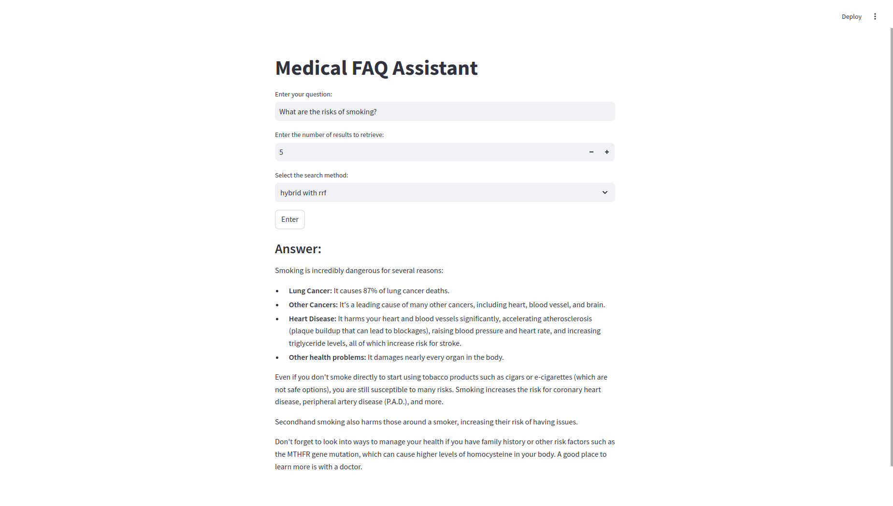

# Final Project for 'LLM-Zoomcamp'

## Introduction

This project utilizes Retrieval-Augmented Generation (RAG) to create a medical assistant capable of answering questions by retrieving relevant information from a medical dataset on Hugging Face. By combining the power of retrieval mechanisms with generative models, the assistant provides contextually accurate and informative responses.

**Important Note**: This medical assistant is not a substitute for professional medical advice, diagnosis, or treatment. Always consult a qualified healthcare provider for any medical concerns.

## Project Details

- Dataset: [keivalya/MedQuad-MedicalQnADataset](https://huggingface.co/datasets/keivalya/MedQuad-MedicalQnADataset)
- LLM: [Gemma2 2b](https://ollama.com/library/gemma2)
- Embedding model: [multi-qa-distilbert-cos-v1](https://huggingface.co/sentence-transformers/multi-qa-distilbert-cos-v1)
- Database: ElasticSearch

## Prerequisites

- Python 3.10 or higher
- Docker

## How to execute it?

1. Create a Python virtual environment and run `pip install -r requirements.txt` to install the required dependencies.

2. Run `./start.sh` to start the Docker containers in detached mode, wait for them to initialize, pull the necessary model into the `ollama` container, and then execute the `index_document.py` script to index your documents.

3. Run `streamlit run app.py`, and you can start asking questions to the medical assistant!

**Warning**: This project has only been tested on Ubuntu 22.04. Compatibility with other operating systems is not guaranteed.

**Below is a preview of the application interface:**

